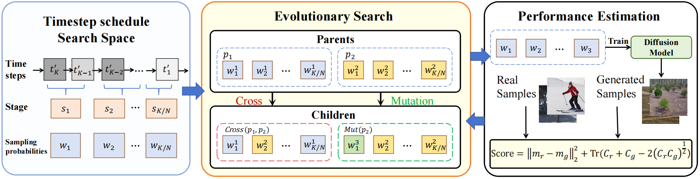

# O2TDM: Diffusion Model Sampling Strategy Optimization

CodeBase for "O2TDM: Optimizing Time-Step Sampling Probabilities in Diffusion Models for Enhanced Training Efficiency"



This project implements an evolutionary algorithm to optimize the sampling strategy of diffusion models. The main goal is to find optimal timestep schedules that can improve the sampling quality and efficiency of pretrained diffusion models.

## Project Overview

The project uses an evolutionary search approach to optimize the sampling strategy of diffusion models. The key features include:

- Evolutionary search for optimal timestep schedules
- FID (Fréchet Inception Distance) score evaluation
- Support for both random search and evolutionary optimization
- Customizable population size and mutation rates
- Integration with pretrained diffusion models

## Key Components

### Main Classes

1. `EvolutionSearcher`: The core class that implements the evolutionary search algorithm
   - Manages population of sampling strategies
   - Performs mutation and crossover operations
   - Evaluates candidates using FID scores

2. `FIDStatistics`: Handles FID score calculations for evaluating generated samples

### Key Functions

- `search()`: Main evolutionary search loop
- `get_mutation()`: Generates mutated candidates
- `get_cross()`: Performs crossover between candidates
- `get_random()`: Generates random sampling strategies
- `get_cand_fid()`: Evaluates candidates using FID score

## Usage

### Prerequisites

This project is based on improved-diffusion. For environment setup, please refer to:
[OpenAI's improved-diffusion](https://github.com/openai/improved-diffusion)

### Running the Search

Basic usage:
```bash
python search_model.py \
    --data_dir /path/to/dataset \
    --model_path /path/to/pretrained_model \
    --batch_size 32 \
    --num_samples 500 \
    --time_step 10 \
    --population_num 10 \
    --max_epochs 2
```
## Setting
setting for CIFAR-10 datasets
```
MODEL_FLAGS="--image_size 64 --num_channels 128 --num_res_blocks 3 --learn_sigma True"
DIFFUSION_FLAGS="--diffusion_steps 4000 --noise_schedule cosine"
TRAIN_FLAGS="--lr 1e-4 --batch_size 32"
```

setting for Anime-faces datasets
```
MODEL_FLAGS="--image_size 64 --num_channels 128 --num_res_blocks 3 --learn_sigma True --dropout 0.1"
DIFFUSION_FLAGS="--diffusion_steps 4000 --noise_schedule cosine"
TRAIN_FLAGS="--lr 2e-5 --batch_size 32"
```

In IDDPM, Once you have setup your hyper-parameters, you can run an experiment like so:

```
python scripts/image_train.py --data_dir path/to/images $MODEL_FLAGS $DIFFUSION_FLAGS $TRAIN_FLAGS
```

The above training script saves checkpoints to `.pt` files in the logging directory. These checkpoints will have names like `ema_0.9999_200000.pt` and `model200000.pt`. You will likely want to sample from the EMA models, since those produce much better samples.

Once you have a path to your model, you can generate a large batch of samples like so:

```
python scripts/image_sample.py --model_path /path/to/model.pt $MODEL_FLAGS $DIFFUSION_FLAGS
```

## Preparing Reference Statistics

Before running the search process, you need to generate reference statistics files for FID calculation. These statistics are computed from a reference dataset and stored as pickle (.pkl) files.

### Generating Reference Statistics

1. First, prepare your reference dataset (e.g., CIFAR-10 training set)

2. Use evaluator_cifar.py to generate reference statistics:
```bash
python evaluations/evaluator_cifar.py \
    reference_batch.npz \  # Path to your reference dataset in npz format
    sample_batch.npz       # Any sample batch for initialization (not used for stats)
```

This will generate three pickle files:
- `cifar10_train_ref_acts.pkl`: Reference activations
- `cifar10_train_ref_stats.pkl`: FID statistics
- `cifar10_train_ref_stats_spatial.pkl`: Spatial FID statistics

### Using Reference Statistics

When running the search process, specify the paths to the reference statistics files:

```bash
python search_model.py \
    --ref_path /path/to/cifar10_train_ref_stats.pkl \
    --ref_spatial_path /path/to/cifar10_train_ref_stats_spatial.pkl \
    [other arguments...]
```

The reference statistics are used to:
- Calculate FID scores for evaluating generated samples
- Compare the quality of different sampling strategies
- Provide consistent evaluation metrics across experiments

Note: Make sure to generate reference statistics using the same dataset and preprocessing as your training data.

### Key Parameters

- `time_step`: Number of sampling points to optimize
- `population_num`: Size of the candidate population
- `select_num`: Number of top candidates to keep
- `mutation_num`: Number of mutations per generation
- `crossover_num`: Number of crossovers per generation
- `m_prob`: Mutation probability

## Evaluation

The project evaluates sampling strategies using:
- FID (Fréchet Inception Distance)
- Spatial FID
- Inception Score

Results are automatically logged and saved during the search process.

## Project Structure

```
.
├── search_model.py      # Main implementation file
├── improved_diffusion/  # Core diffusion model implementation
├── evaluations/         # Evaluation metrics implementation
├── datasets/           # Dataset handling
└── scripts/           # Additional utility scripts
```

## Notes

- The project supports both random search and evolutionary search strategies
- FID scores are used as the primary metric for evaluation
- The search process can be customized through various hyperparameters
- Results are automatically saved and logged during the search process

## Citation

If you use this code in your research, please cite:
```
@misc{diffusion_evolution_search,
  title={Evolutionary Search for Optimal Diffusion Model Sampling},
  author={Beibei Zhang},
  year={2025}
}
``` 